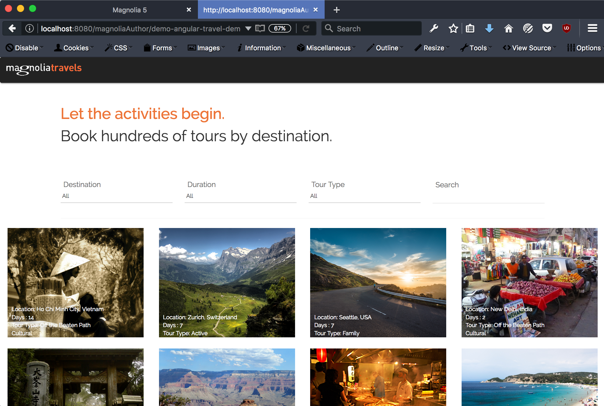
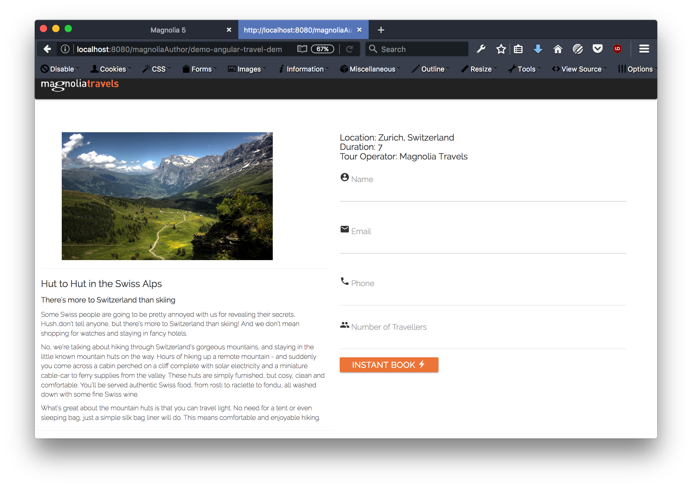

# angular-travel-demo

A demonstration of a single page Angular 1 app using content from the Magnolia Travel Demo.   

## Features
> [Provide a list of the key features this component provides for content authors. Include screenshots of the rendered component and the dialog.]

* A page template delivers an Angular 1, single page app including Angular navigation via # to detail pages.
* Reflects any changes made in the Tours and Tour Categories content apps.
* Demonstrates accessing content as json via jsonfn module.
* Demonstrates headless CMS techniques.

## Usage

The jsonfn module must be available. You can get it at https://nexus.magnolia-cms.com/service/local/repositories/magnolia.forge.releases/content/info/magnolia/templating/magnolia-jsonfn/1.0.7/magnolia-jsonfn-1.0.7.jar. For your convienience it is also available in the `_dev/jars` directory.

Copy this jar into Magnolia's `WEB-INF/libs` directory and restart the server.

Create a page, and use the 'Angular Travel Demo' template.

## Information on Magnolia CMS
This directory is a Magnolia 'light module'.

https://docs.magnolia-cms.com

Search the docs for `sharing light modules` for details on how to share and use light modules on npm and github.

## License

MIT

## Contributors

Magnolia, https://magnolia-cms.com

Iran Campos, @icdozen
